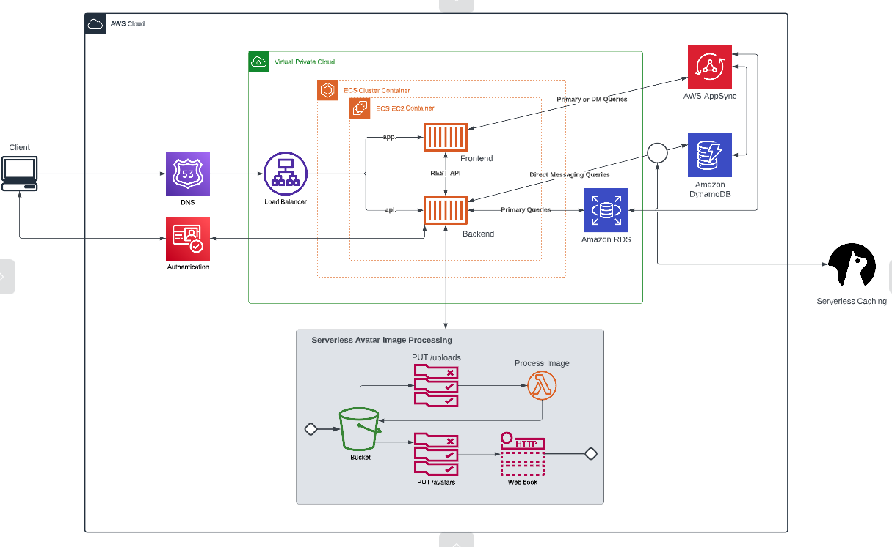
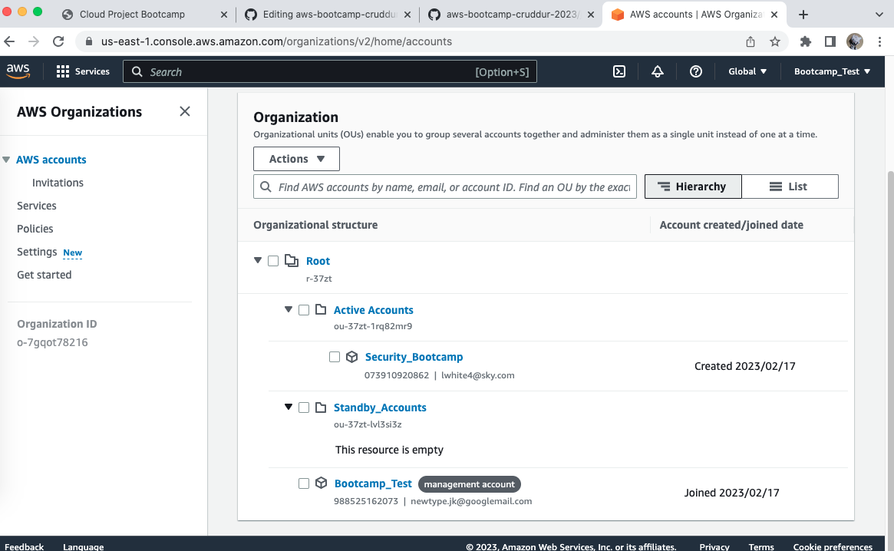
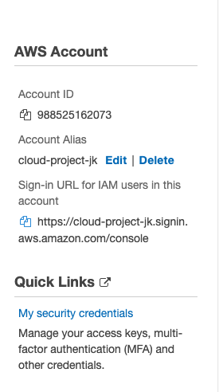

# Week 0 — Billing and Architecture

## Required Homework

### Videos

All required videos watched and practical elements followed along with.

### Recreate diagrams, conceptual and logical

Both diagrams recreated on Lucid Charts, screenshots and share links both below.

[Lucid charts share link - conceptual](https://lucid.app/lucidchart/e94f2a00-9098-45ee-aacb-4cfa94beb80e/edit?viewport_loc=-1235%2C-282%2C1794%2C924%2C0_0&invitationId=inv_1bfbde00-a16f-4092-a807-d3c31034c9cf)

[Lucid charts share link - logical](https://lucid.app/lucidchart/af811d60-cfb8-45db-a8c1-0b0579ad41b8/edit?viewport_loc=-648%2C-1042%2C2004%2C1032%2C0_0&invitationId=inv_4ecd12c4-0c77-4be9-aadf-df3a2285e24b)

### Github and Gitpod, with AWS CLI install

Followed along in my own time.  I'm new to these services and wanted to take my time and understand what was happening.  Followed on Macbook with no hold-ups.

### Security video

Used the instructions to create an AWS Organization with the suggested set up of Active Accounts / Standby Accounts.
Screenshot below.

### IAM

I also really liked the idea of an account alias for the IAM users, so I've set that up too, for ease.  Plus all users are set up with MFA.

### Lastly!

I've really enjoyed picking up a lot of new practical experience even though it's only Week 0.  Looking forward to the next set of tasks!
