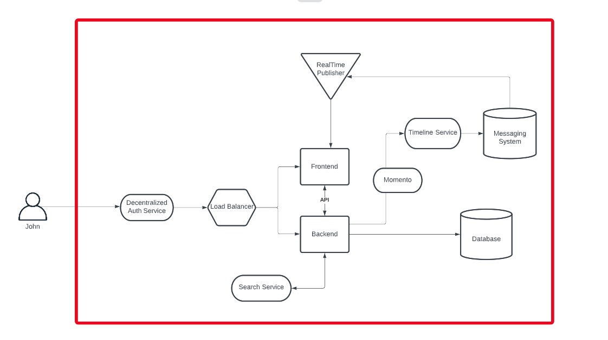

# Week 0 — Billing and Architecture

## Required Homework

### Videos

All required videos watched and practical elements followed along with.

### Recreate diagrams, conceptual and logical

Both diagrams recreated on Lucid Charts, screenshots and share links both below.

[Lucid charts share link - conceptual](https://lucid.app/lucidchart/e94f2a00-9098-45ee-aacb-4cfa94beb80e/edit?viewport_loc=-1235%2C-282%2C1794%2C924%2C0_0&invitationId=inv_1bfbde00-a16f-4092-a807-d3c31034c9cf)

[Lucid charts share link - logical](https://lucid.app/lucidchart/af811d60-cfb8-45db-a8c1-0b0579ad41b8/edit?viewport_loc=-648%2C-1042%2C2004%2C1032%2C0_0&invitationId=inv_4ecd12c4-0c77-4be9-aadf-df3a2285e24b)

